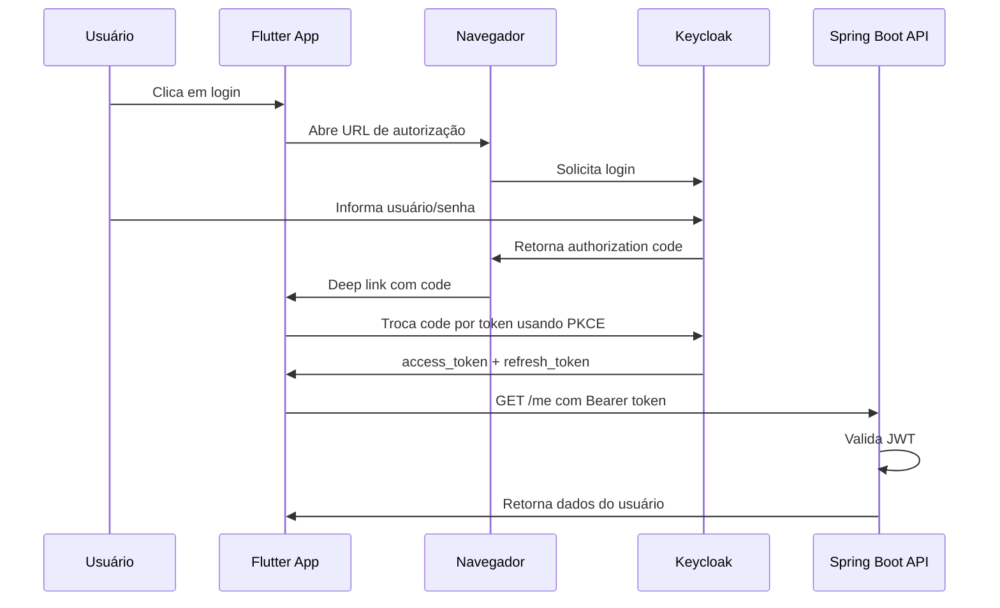

# Guia didático completo — Keycloak + Flutter + Spring Boot + PKCE + preparação para GOV.BR

> Este guia foi escrito como se a pessoa estivesse começando do zero.  
> A ideia é permitir que qualquer pessoa recrie o laboratório, entenda o motivo de cada configuração e consiga testar o fluxo manualmente antes de usar o Flutter.

---

## Sumário

1. [Objetivo do laboratório](#1-objetivo-do-laboratório)
2. [Conceitos fundamentais](#2-conceitos-fundamentais)
3. [Arquitetura geral](#3-arquitetura-geral)
4. [Por que usamos Keycloak?](#4-por-que-usamos-keycloak)
5. [Por que usamos PKCE?](#5-por-que-usamos-pkce)
6. [Por que precisamos de HTTPS?](#6-por-que-precisamos-de-https)
7. [Componentes do laboratório](#7-componentes-do-laboratório)
8. [Subindo o Keycloak com Docker](#8-subindo-o-keycloak-com-docker)
9. [Expondo o Keycloak com Cloudflare Tunnel](#9-expondo-o-keycloak-com-cloudflare-tunnel)
10. [Criando o Realm](#10-criando-o-realm)
11. [Criando roles](#11-criando-roles)
12. [Criando usuário de teste](#12-criando-usuário-de-teste)
13. [Criando o client flutter-app](#13-criando-o-client-flutter-app)
14. [Criando o client auth-api](#14-criando-o-client-auth-api)
15. [Validando o OpenID Configuration](#15-validando-o-openid-configuration)
16. [Teste manual com Insomnia — Direct Access Grant](#16-teste-manual-com-insomnia--direct-access-grant)
17. [Teste manual com Authorization Code + PKCE](#17-teste-manual-com-authorization-code--pkce)
18. [Configuração do backend Spring Boot](#18-configuração-do-backend-spring-boot)
19. [Configuração do Flutter](#19-configuração-do-flutter)
20. [Erros comuns e soluções](#20-erros-comuns-e-soluções)
21. [Como testar tudo ponta a ponta](#21-como-testar-tudo-ponta-a-ponta)
22. [Preparação para GOV.BR](#22-preparação-para-govbr)
23. [Checklist final](#23-checklist-final)

---

# 1. Objetivo do laboratório

O objetivo deste laboratório é montar um fluxo realista de autenticação usando:

- **Keycloak** como servidor de identidade.
- **Flutter** como aplicação mobile.
- **Spring Boot** como backend/API protegida.
- **OAuth2/OpenID Connect** como protocolo de autenticação/autorização.
- **Authorization Code + PKCE** como fluxo seguro para aplicativo mobile.
- **Cloudflare Tunnel** para fornecer HTTPS local.
- **Insomnia** para testes manuais.

Ao final, você terá este fluxo funcionando:

```text
Usuário
   ↓
App Flutter
   ↓
Navegador do sistema
   ↓
Keycloak
   ↓
Retorno para o app via deep link
   ↓
Flutter recebe access token
   ↓
Flutter chama backend Spring Boot
   ↓
Backend valida JWT e responde /me
```

---

# 2. Conceitos fundamentais

## 2.1. O que é autenticação?

Autenticação é o processo de descobrir **quem é o usuário**.

Exemplo:

```text
Usuário: lucas
Senha: 123456
```

Se o sistema confirma que esse usuário existe e que a senha está correta, ele foi autenticado.

---

## 2.2. O que é autorização?

Autorização é o processo de decidir **o que o usuário pode fazer**.

Exemplo:

```text
lucas pode acessar /me
lucas pode acessar /admin/test somente se tiver role admin
```

Ou seja:

- Autenticação = quem é você?
- Autorização = o que você pode acessar?

---

## 2.3. O que é OAuth2?

OAuth2 é um protocolo usado para permitir acesso a recursos protegidos usando tokens.

No nosso caso:

```text
Flutter recebe um access_token
Flutter envia esse token para o backend
Backend valida o token
Backend libera ou bloqueia o acesso
```

---

## 2.4. O que é OpenID Connect?

OpenID Connect, ou OIDC, é uma camada em cima do OAuth2 que permite autenticação de usuário.

OAuth2 sozinho fala muito sobre autorização.  
OIDC adiciona identidade do usuário.

Por isso usamos scopes como:

```text
openid
profile
email
```

Esses scopes permitem receber informações como:

```json
{
  "preferred_username": "lucas",
  "name": "Lucas Viegas",
  "email": "lucas.viegas006@gmail.com"
}
```

---

## 2.5. O que é JWT?

JWT significa JSON Web Token.

É um token com informações codificadas, como:

```json
{
  "sub": "8d476f1c-6098-48b0-95f4-17dbc5b10055",
  "preferred_username": "lucas",
  "email": "lucas.viegas006@gmail.com",
  "realm_access": {
    "roles": ["admin"]
  }
}
```

O backend não precisa consultar o Keycloak a cada requisição.  
Ele valida a assinatura do token usando as chaves públicas do Keycloak.

---

## 2.6. O que é um Realm no Keycloak?

Um realm é como um “ambiente isolado” dentro do Keycloak.

Exemplo:

```text
master
lab-realm
empresa-a
empresa-b
```

Cada realm tem:

- usuários próprios;
- clients próprios;
- roles próprias;
- configurações próprias.

Neste laboratório, usamos:

```text
lab-realm
```

---

## 2.7. O que é um Client no Keycloak?

Um client representa uma aplicação que vai usar o Keycloak.

Neste laboratório, criamos dois clients:

```text
flutter-app
auth-api
```

### flutter-app

Representa o aplicativo Flutter.

Ele usa:

```text
Authorization Code + PKCE
```

### auth-api

Representa um client auxiliar para testes manuais no Insomnia usando:

```text
grant_type=password
```

---

## 2.8. O que é uma role?

Role é um papel/permissão.

Exemplo:

```text
admin
user
manager
```

No backend Spring, podemos mapear isso para:

```text
ROLE_ADMIN
ROLE_USER
```

E proteger rotas:

```java
hasRole("ADMIN")
```

---

# 3. Arquitetura geral

## 3.1. Arquitetura atual do laboratório

```text
+-------------------+
|   Flutter App     |
+---------+---------+
          |
          | abre navegador
          v
+-------------------+
|     Keycloak      |
|  lab-realm        |
+---------+---------+
          |
          | emite JWT
          v
+-------------------+
| Spring Boot API   |
| Resource Server   |
+-------------------+
```

---

## 3.2. Fluxo detalhado

```text
1. Usuário toca em "Login" no Flutter.
2. Flutter abre o navegador do sistema.
3. Navegador acessa o Keycloak.
4. Usuário digita login e senha no Keycloak.
5. Keycloak retorna para o app usando deep link.
6. Flutter recebe um authorization code.
7. Flutter troca esse code por access_token usando PKCE.
8. Flutter chama o backend com Authorization: Bearer <token>.
9. Backend valida o JWT.
10. Backend retorna os dados do usuário.
```

---

## 3.3. Diagrama Mermaid



---

# 4. Por que usamos Keycloak?

O Keycloak é um servidor de identidade pronto.

Ele evita que você precise implementar do zero:

- tela de login;
- cadastro de usuário;
- hash de senha;
- emissão de token;
- refresh token;
- integração OIDC;
- roles;
- federação com provedores externos;
- login com gov.br no futuro.

Em vez de o app Flutter fazer login direto no backend, ele usa o Keycloak como Identity Provider.

---

# 5. Por que usamos PKCE?

PKCE significa Proof Key for Code Exchange.

Ele protege o fluxo de Authorization Code em aplicações públicas, como apps mobile.

Um app mobile **não consegue guardar client secret com segurança**, porque qualquer pessoa pode inspecionar o app instalado.

Então, em vez de usar `client_secret`, o app usa dois valores:

```text
code_verifier
code_challenge
```

## 5.1. Como funciona?

1. O app gera um `code_verifier` aleatório.
2. O app calcula um `code_challenge` a partir do verifier.
3. O app envia o `code_challenge` na URL de login.
4. Depois, na troca do code por token, envia o `code_verifier`.
5. O Keycloak verifica se o verifier combina com o challenge.

Se alguém interceptar o authorization code, não consegue trocar por token sem o `code_verifier`.

---

# 6. Por que precisamos de HTTPS?

O AppAuth no Android não permite buscar discovery/token endpoint em HTTP.

Se você usar:

```text
http://localhost:8080/realms/lab-realm
```

pode receber erro:

```text
only https connections are permitted
```

Por isso usamos Cloudflare Tunnel para transformar:

```text
http://localhost:8080
```

em:

```text
https://alguma-url.trycloudflare.com
```

---

# 7. Componentes do laboratório

## 7.1. Keycloak

Roda localmente na porta:

```text
8080
```

Mas é acessado externamente via Cloudflare:

```text
https://SUA-URL.trycloudflare.com
```

## 7.2. Spring Boot

Roda na porta:

```text
9000
```

Exemplo de endpoint:

```text
GET /me
```

## 7.3. Flutter

Usa:

```text
flutter_appauth
```

para abrir o navegador e realizar o fluxo OIDC.

## 7.4. Insomnia

Usado para:

- testar `grant_type=password`;
- testar troca manual do authorization code;
- testar backend com Bearer token.

---

# 8. Subindo o Keycloak com Docker

## 8.1. Criar volume persistente

Sem volume, ao remover o container, você perde:

- realm;
- clients;
- usuários;
- roles.

Crie o volume:

```bash
docker volume create keycloak_data
```

## 8.2. Subir o Keycloak

Use este comando, trocando a URL:

```bash
docker run -d --name keycloak-lab -p 8080:8080 -v keycloak_data:/opt/keycloak/data -e KC_BOOTSTRAP_ADMIN_USERNAME=admin -e KC_BOOTSTRAP_ADMIN_PASSWORD=admin123 -e KC_PROXY_HEADERS=xforwarded -e KC_HTTP_ENABLED=true -e KC_HOSTNAME=https://SUA-URL.trycloudflare.com quay.io/keycloak/keycloak:26.6.0 start-dev
```

## 8.3. Explicação do comando

```bash
docker run -d
```

Roda o container em segundo plano.

```bash
--name keycloak-lab
```

Dá um nome fixo ao container.

```bash
-p 8080:8080
```

Expõe a porta 8080 do container na porta 8080 da máquina.

```bash
-v keycloak_data:/opt/keycloak/data
```

Persiste os dados do Keycloak.

```bash
KC_BOOTSTRAP_ADMIN_USERNAME=admin
KC_BOOTSTRAP_ADMIN_PASSWORD=admin123
```

Cria o usuário admin inicial.

```bash
KC_PROXY_HEADERS=xforwarded
```

Faz o Keycloak respeitar os headers enviados pelo Cloudflare Tunnel.

```bash
KC_HTTP_ENABLED=true
```

Permite HTTP internamente, já que o HTTPS é feito pelo Cloudflare.

```bash
KC_HOSTNAME=https://SUA-URL.trycloudflare.com
```

Faz o Keycloak gerar endpoints HTTPS corretos.

---

# 9. Expondo o Keycloak com Cloudflare Tunnel

## 9.1. Subir o tunnel

```bash
cloudflared tunnel --url http://localhost:8080
```

A saída será parecida com:

```text
Your quick Tunnel has been created!
https://treat-motor-phantom-seemed.trycloudflare.com
```

## 9.2. Atenção

Quick Tunnel gera URL temporária.  
Quando você para e roda de novo, a URL muda.

Quando a URL mudar, atualize:

- `KC_HOSTNAME`;
- `issuer` do Flutter;
- URL usada no Insomnia.

---

# 10. Criando o Realm

1. Acesse o Admin Console.
2. Faça login com:

```text
admin / admin123
```

3. Clique no seletor de realm.
4. Clique em **Create realm**.
5. Crie:

```text
lab-realm
```

Nunca configure seu app no realm `master`.  
O realm `master` deve ser usado apenas para administração.

---

# 11. Criando roles

## 11.1. Criar role admin

1. Entre no realm `lab-realm`.
2. Vá em **Realm roles**.
3. Clique em **Create role**.
4. Nome:

```text
admin
```

5. Salve.

Essa role será enviada dentro do token JWT em:

```json
"realm_access": {
  "roles": [
    "admin"
  ]
}
```

---

# 12. Criando usuário de teste

## 12.1. Criar usuário

1. Vá em **Users**.
2. Clique em **Create new user**.
3. Preencha:

```text
Username: lucas
Email: lucas.viegas006@gmail.com
First name: Lucas
Last name: Viegas
```

4. Salve.

## 12.2. Definir senha

1. Entre no usuário criado.
2. Vá em **Credentials**.
3. Configure:

```text
Password: 123456
Password confirmation: 123456
Temporary: OFF
```

4. Salve.

Se `Temporary` ficar ON, o Keycloak pode exigir troca de senha no próximo login.

## 12.3. Remover required actions

Verifique se não existem ações obrigatórias pendentes:

```text
UPDATE_PASSWORD
VERIFY_EMAIL
CONFIGURE_OTP
UPDATE_PROFILE
```

Para o laboratório, deixe sem ações pendentes.

## 12.4. Atribuir role admin

1. Entre no usuário.
2. Vá em **Role mapping**.
3. Clique em **Assign role**.
4. Selecione:

```text
admin
```

5. Confirme.

---

# 13. Criando o client flutter-app

Este client é usado pelo app Flutter.

## 13.1. Criar client

1. Vá em **Clients**.
2. Clique em **Create client**.
3. Configure:

```text
Client type: OpenID Connect
Client ID: flutter-app
```

4. Clique em **Next**.

## 13.2. Capability Config

Configure:

```text
Client authentication: OFF
Authorization: OFF
Standard flow: ON
Direct access grants: OFF
Service accounts roles: OFF
```

## 13.3. Explicação campo por campo

### Client authentication = OFF

O Flutter é um client público.  
Isso significa que ele não consegue guardar um segredo com segurança.

Por isso, não usamos client secret.

### Standard Flow = ON

Esse é o fluxo Authorization Code.  
É o fluxo correto para login com redirecionamento.

### Direct Access Grants = OFF

Não queremos que o app mobile envie usuário e senha diretamente para o Keycloak.

O login deve acontecer no navegador.

### Service Accounts = OFF

Não estamos usando machine-to-machine.

### Authorization = OFF

Não estamos usando os recursos avançados de autorização do Keycloak neste laboratório.

## 13.4. Login Settings

Configure:

```text
Valid Redirect URIs:
br.com.lucas.authlab://callback
```

Opcional:

```text
Valid Post Logout Redirect URIs:
br.com.lucas.authlab://callback
```

Web Origins:

```text
+
```

ou vazio, se estiver usando apenas mobile.

## 13.5. PKCE

Em configuração avançada do client, defina:

```text
Proof Key for Code Exchange Code Challenge Method: S256
```

Isso força o client a usar PKCE com SHA-256.

## 13.6. Resumo

```text
Client ID: flutter-app
Client Authentication: OFF
Standard Flow: ON
Direct Access Grants: OFF
PKCE: S256
Redirect URI: br.com.lucas.authlab://callback
```

---

# 14. Criando o client auth-api

Esse client é usado para testes manuais no Insomnia com senha.

## 14.1. Criar client

1. Vá em **Clients**.
2. Clique em **Create client**.
3. Configure:

```text
Client type: OpenID Connect
Client ID: auth-api
```

## 14.2. Capability Config

Configure:

```text
Client authentication: OFF
Authorization: OFF
Standard flow: OFF
Direct access grants: ON
Service accounts roles: OFF
```

## 14.3. Explicação

### Direct Access Grants = ON

Permite testar:

```text
grant_type=password
```

Isso é útil no Insomnia, mas não deve ser o fluxo principal de app mobile.

### Standard Flow = OFF

Esse client não será usado no login via navegador.

## 14.4. Resumo

```text
Client ID: auth-api
Client Authentication: OFF
Standard Flow: OFF
Direct Access Grants: ON
```

---

# 15. Validando o OpenID Configuration

Abra:

```text
https://SUA-URL.trycloudflare.com/realms/lab-realm/.well-known/openid-configuration
```

Deve aparecer JSON.

Confira:

```json
"issuer": "https://SUA-URL.trycloudflare.com/realms/lab-realm"
```

e:

```json
"token_endpoint": "https://SUA-URL.trycloudflare.com/realms/lab-realm/protocol/openid-connect/token"
```

Se aparecer HTTP, corrija `KC_HOSTNAME`.

---

# 16. Teste manual com Insomnia — Direct Access Grant

Este teste é simples e serve para validar:

- realm;
- usuário;
- senha;
- client auth-api;
- emissão de token.

## 16.1. Request

Método:

```text
POST
```

URL:

```text
https://SUA-URL.trycloudflare.com/realms/lab-realm/protocol/openid-connect/token
```

Body:

```text
Form URL Encoded
```

Campos:

| Key | Value |
|---|---|
| client_id | auth-api |
| grant_type | password |
| username | lucas |
| password | 123456 |

## 16.2. Não usar JSON

Errado:

```json
{
  "client_id": "auth-api",
  "grant_type": "password",
  "username": "lucas",
  "password": "123456"
}
```

Correto:

```text
client_id=auth-api&grant_type=password&username=lucas&password=123456
```

## 16.3. Resultado esperado

```json
{
  "access_token": "...",
  "refresh_token": "...",
  "token_type": "Bearer",
  "expires_in": 300
}
```

---

# 17. Teste manual com Authorization Code + PKCE

Este teste simula o que o Flutter faz automaticamente.

## 17.1. Gerar code_verifier e code_challenge

No PowerShell:

```powershell
$bytes = New-Object byte[] 32
[System.Security.Cryptography.RandomNumberGenerator]::Create().GetBytes($bytes)

$codeVerifier = [Convert]::ToBase64String($bytes).TrimEnd('=').Replace('+','-').Replace('/','_')

$sha256 = [System.Security.Cryptography.SHA256]::Create()
$hash = $sha256.ComputeHash([System.Text.Encoding]::ASCII.GetBytes($codeVerifier))
$codeChallenge = [Convert]::ToBase64String($hash).TrimEnd('=').Replace('+','-').Replace('/','_')

Write-Host "code_verifier: $codeVerifier"
Write-Host "code_challenge: $codeChallenge"
```

Guarde os dois.

## 17.2. Adicionar redirect temporário

No client `flutter-app`, adicione:

```text
http://127.0.0.1:3000/callback
```

em:

```text
Valid Redirect URIs
```

## 17.3. Abrir URL de autorização

```text
https://SUA-URL.trycloudflare.com/realms/lab-realm/protocol/openid-connect/auth?client_id=flutter-app&response_type=code&scope=openid%20profile%20email&redirect_uri=http://127.0.0.1:3000/callback&code_challenge=SEU_CODE_CHALLENGE&code_challenge_method=S256
```

Substitua `SEU_CODE_CHALLENGE`.

## 17.4. Fazer login

Use:

```text
lucas / 123456
```

Depois do login, o navegador tentará abrir:

```text
http://127.0.0.1:3000/callback?code=...
```

Copie apenas o valor de `code`.

## 17.5. Trocar code por token no Insomnia

Método:

```text
POST
```

URL:

```text
https://SUA-URL.trycloudflare.com/realms/lab-realm/protocol/openid-connect/token
```

Body:

```text
Form URL Encoded
```

Campos:

| Key | Value |
|---|---|
| grant_type | authorization_code |
| client_id | flutter-app |
| code | código copiado da URL |
| redirect_uri | http://127.0.0.1:3000/callback |
| code_verifier | code_verifier original |

## 17.6. Resultado esperado

```json
{
  "access_token": "...",
  "refresh_token": "...",
  "id_token": "...",
  "token_type": "Bearer"
}
```

---

# 18. Configuração do backend Spring Boot

O backend deve atuar como Resource Server.

## 18.1. application.properties

```properties
server.port=9000

spring.security.oauth2.resourceserver.jwt.issuer-uri=https://SUA-URL.trycloudflare.com/realms/lab-realm
```

## 18.2. Exemplo de SecurityConfig

```java
@Configuration
@EnableMethodSecurity
public class SecurityConfig {

    @Bean
    public SecurityFilterChain securityFilterChain(HttpSecurity http) throws Exception {
        http
            .csrf(csrf -> csrf.disable())
            .authorizeHttpRequests(auth -> auth
                .requestMatchers("/", "/auth/status").permitAll()
                .requestMatchers("/admin/test").hasRole("ADMIN")
                .anyRequest().authenticated()
            )
            .oauth2ResourceServer(oauth2 -> oauth2
                .jwt(Customizer.withDefaults())
            );

        return http.build();
    }
}
```

## 18.3. Endpoint /me

```java
@GetMapping("/me")
public ResponseEntity<?> me(@AuthenticationPrincipal Jwt jwt) {
    return ResponseEntity.ok(Map.of(
        "subject", jwt.getSubject(),
        "username", jwt.getClaimAsString("preferred_username"),
        "name", jwt.getClaimAsString("name"),
        "email", jwt.getClaimAsString("email")
    ));
}
```

---

# 19. Configuração do Flutter

## 19.1. Dependências

```yaml
dependencies:
  flutter_appauth: ^12.0.0
  http: ^1.2.2
```

## 19.2. AuthService

```dart
import 'package:flutter_appauth/flutter_appauth.dart';

class AuthService {
  static const String clientId = 'flutter-app';
  static const String redirectUrl = 'br.com.lucas.authlab://callback';
  static const String issuer = 'https://SUA-URL.trycloudflare.com/realms/lab-realm';

  final FlutterAppAuth appAuth = const FlutterAppAuth();

  Future<AuthorizationTokenResponse?> login() {
    return appAuth.authorizeAndExchangeCode(
      const AuthorizationTokenRequest(
        clientId,
        redirectUrl,
        issuer: issuer,
        scopes: ['openid', 'profile', 'email'],
      ),
    );
  }
}
```

## 19.3. Android build.gradle

```gradle
manifestPlaceholders += [
    appAuthRedirectScheme: "br.com.lucas.authlab"
]
```

## 19.4. AndroidManifest.xml

Adicione `tools` no manifest:

```xml
<manifest xmlns:android="http://schemas.android.com/apk/res/android"
    xmlns:tools="http://schemas.android.com/tools">
```

Dentro de `<application>`:

```xml
<activity
    android:name="net.openid.appauth.RedirectUriReceiverActivity"
    android:theme="@style/Theme.AppCompat.Translucent.NoTitleBar"
    android:exported="true"
    tools:node="replace">
    <intent-filter>
        <action android:name="android.intent.action.VIEW" />
        <category android:name="android.intent.category.DEFAULT" />
        <category android:name="android.intent.category.BROWSABLE" />
        <data
            android:scheme="br.com.lucas.authlab"
            android:host="callback" />
    </intent-filter>
</activity>
```

Se existir:

```xml
android:taskAffinity=""
```

remova.

---

# 20. Erros comuns e soluções

## 20.1. only https connections are permitted

Causa:

- AppAuth tentou acessar endpoint HTTP.

Solução:

- usar Cloudflare Tunnel;
- configurar `KC_HOSTNAME` com HTTPS;
- conferir discovery JSON.

## 20.2. Page not found no lab-realm

Causa:

- Realm não existe.
- Container foi recriado sem volume.

Solução:

- recriar `lab-realm`;
- usar volume persistente.

## 20.3. Missing form parameter: grant_type

Causa:

- Body errado no Insomnia.

Solução:

- Body → Form URL Encoded.

## 20.4. Client not allowed for direct access grants

Causa:

- `Direct Access Grants` OFF no client `auth-api`.

Solução:

- ligar Direct Access Grants.

## 20.5. Account is not fully set up

Causa:

- senha temporária;
- required action pendente.

Solução:

- Temporary OFF;
- remover required actions.

## 20.6. Code not valid

Causa:

- code expirado;
- code usado mais de uma vez;
- redirect_uri diferente;
- code_verifier errado.

Solução:

- gerar novo PKCE;
- obter novo code;
- trocar imediatamente.

## 20.7. No stored state - unable to handle response

Causa:

- problema no retorno do AppAuth;
- `android:taskAffinity=""`;
- configuração de deep link inconsistente.

Solução:

- remover `android:taskAffinity=""`;
- revisar scheme e host;
- conferir redirect URI.

---

# 21. Como testar tudo ponta a ponta

1. Subir Keycloak.
2. Subir Cloudflare Tunnel.
3. Conferir discovery OIDC.
4. Criar realm, usuário, roles e clients.
5. Testar token no Insomnia com `auth-api`.
6. Testar PKCE manual com `flutter-app`.
7. Rodar Flutter.
8. Fazer login.
9. Chamar backend `/me`.
10. Testar endpoint protegido por role.

---

# 22. Preparação para GOV.BR

## 22.1. Arquitetura futura

```text
Flutter
   ↓
Keycloak
   ↓
GOV.BR
   ↓
Keycloak
   ↓
Backend Spring
```

## 22.2. O que muda?

O Flutter continua falando com o Keycloak.  
O backend continua validando token do Keycloak.  
O Keycloak passa a redirecionar para o gov.br.

## 22.3. O que será necessário do GOV.BR?

- Autorização institucional.
- Client ID.
- Client Secret, se aplicável.
- Authorization endpoint.
- Token endpoint.
- UserInfo endpoint.
- JWKS endpoint.
- Redirect URI cadastrada.

A redirect URI do Keycloak para o broker será parecida com:

```text
https://SEU_KEYCLOAK/realms/lab-realm/broker/govbr/endpoint
```

## 22.4. Configuração futura no Keycloak

Em:

```text
Identity Providers → OpenID Connect v1.0
```

Criar:

```text
Alias: govbr
Display name: Entrar com gov.br
```

Depois preencher os endpoints e credenciais fornecidos pelo gov.br.

---

# 23. Checklist final

## Keycloak

- [ ] Keycloak rodando.
- [ ] Cloudflare Tunnel rodando.
- [ ] KC_HOSTNAME atualizado.
- [ ] Realm `lab-realm` criado.
- [ ] Role `admin` criada.
- [ ] Usuário `lucas` criado.
- [ ] Senha temporária OFF.
- [ ] Role `admin` atribuída.
- [ ] Client `flutter-app` criado.
- [ ] Client `flutter-app` com PKCE S256.
- [ ] Client `flutter-app` com redirect correto.
- [ ] Client `auth-api` criado.
- [ ] Client `auth-api` com Direct Access Grants ON.

## Flutter

- [ ] `issuer` com HTTPS.
- [ ] `redirectUrl` correto.
- [ ] Deep link Android configurado.
- [ ] Login abre navegador.
- [ ] Login retorna ao app.
- [ ] App recebe token.
- [ ] App chama backend.

## Backend

- [ ] `issuer-uri` correto.
- [ ] `/me` com token retorna 200.
- [ ] `/me` sem token retorna 401.
- [ ] `/admin/test` com admin retorna 200.

---

# Conclusão

Este laboratório ensina um fluxo realista e moderno de autenticação para aplicações mobile.

Você validou:

```text
Flutter + Keycloak + Authorization Code + PKCE + Spring Boot Resource Server
```

Esse desenho é adequado para evoluir futuramente para:

```text
Flutter + Keycloak + GOV.BR + Spring Boot
```

sem reescrever a aplicação mobile nem o backend.
